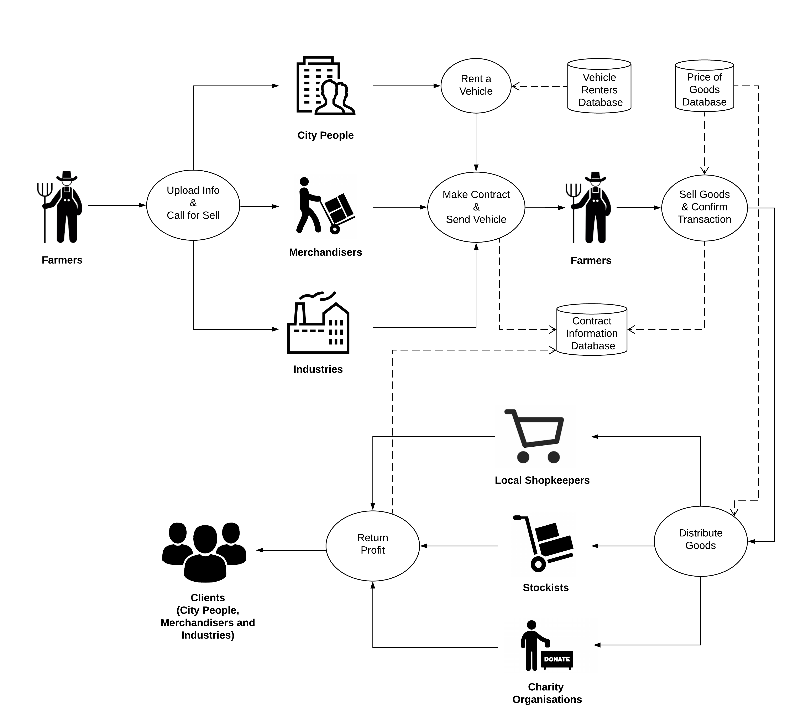

# Shongjog

## Background  
As an agro-based country, Bangladesh has immense potential and dependency on the food market.
Unfortunately there are several bottlenecks in the prevailing food supply chain of the country which
degrades the overall productivity, efficiency and transparency of the system. Here, the root of all the
parasites lies in the excessive number of intermediaries (i.e. foria, bepari, aratdar, dealer, wholesaler and
retailer) in the supply process that instigate unexpected price hike and hampers the business efficiency.
This opaque process is also beset with the crux of illegal extortion during those hand changes amidst the
intermediaries. As a consequence, the two end bodies of the chain, i.e. the farmers (producer) and
consumers are the scapegoats of this issue, where the producers are paid poorly and the consumers have
to pay a high price to buy the foodstuffs.  
Hence we come up with the idea of introducing a systematic platform to put together the agricultural food
supply chain by creating a bridge between the remote farmers and the city people as well as different
organizations, merchandisers and manufacturing industries. Our goal is to ensure fairness and flexibility
to the food supply process through reducing the number of intermediaries as well as effectively engaging
the farmers into the marketplace.  

## System Architecture  
A high level illustration of our proposed solution model is as follows:  
❏At first, farmers (themselves or with the help of the local administrative body) will upload the quantity
of each of their produced foodstuffs using the app (or web-platform), notifying prospective clients for
potential purchase.  
❏ Clients basically consist of city people, merchandisers and manufacturing industries, especially those
who possess a good amount of transportation support. They can make contracts with the farmers and send their vehicles to their places.  
❏ We will store contact information of vehicle renters in our system. If someone is willing to make a
contract but doesn’t have any vehicle of their own, they’ll have the option to rent a vehicle using the
application, make a contract and send it to the farmer’s place.  
❏We will set, and regularly update the pricing of vegetables and other agricultural foodstuffs in our
system. The farmers will sell their goods to the client as per the pricing policy.  
❏After purchasing goods from the farmer, the vehicle will carry them back to the town and the client
decides where to distribute them.  
❏We will store contact information of local shopkeepers, stockists and different charity organizations
those who are interested to buy foodstuffs in wholesale.  
❏ Clients will have the choice to make a deal with any of them and sell their purchased goods as per the
pricing policy of our system.  
❏ Finally, after successfully completing the retrieval of the foodstuffs, the client's account will be
credited with the amount of profit they have made so far.  
❏All of the transactions in different phases mentioned above will be done using any of the existing online and mobile payment services.
A diagrammatic illustration of our entire model is shown in the following figure.

## Advances:  
- Useful utilization of existing technology for the betterment of the food market.  
- Reduce the inessential intermediaries of conventional systems.  
- Ensure transparency at each phase of the marketplace.  
- Increase fairness at both farmers’ and consumers’ end.

